autoscale: true
theme: next, 1
code-language: Python

## AI In Healthcare, Homework 4: Mimic NLP
### [Evan Jones](mailto:evan_jones@utexas.edu), UT ID:  `ej8387`


---

# Extract Laryngomalacia notes from database; store in dictionary:
Laryngomalacia is a constriction in the larynx, common in newborns. It usually
resolves within a few months of age. My kid had it, and he made cute wheezing 
noises with every breath for a few weeks. 

```python
import sqlite_utils
import time
db = sqlite_utils.Database('../mimic3.db')
# "Laryngomalacia is a constriction in the larynx, common in newborns"
disease_name = "Laryngomalacia"
start = time.time()
results = db.query("SELECT * FROM noteevents WHERE LOWER(TEXT) LIKE '%{}%'".format(disease_name))
disease_notes = list(results)
elapsed = time.time() - start
print(f"Found {len(disease_notes)} entries containing {disease_name} in {elapsed:.2f}s")
```

**Results:**  `Found 93 entries containing Laryngomalacia in 14.31s`

---

## Choose one note to display for demonstration purposes
Once we've extracted a single note, we can refer to it as `demo_note` through 
the rest of the notebook.

```python
# For demonstration purposes, let's choose a single note to display
import random
random.seed(42)
note_index = random.randint(0, len(disease_notes))
demo_note = disease_notes[note_index]["TEXT"]
print(
    f"Displaying note {note_index} out of {len(disease_notes)} notes: \n{demo_note}"
)
```

---

## Extract Note Entities with Spacy and show results

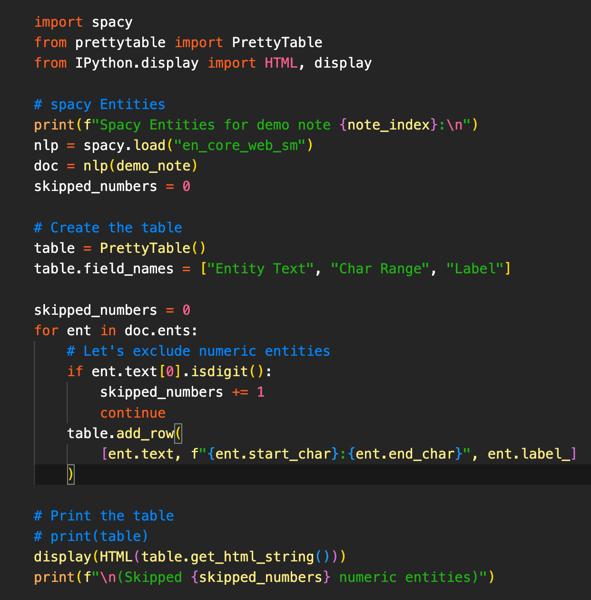

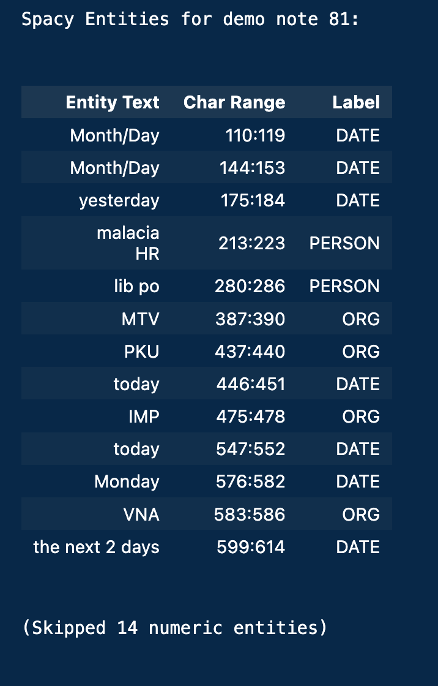

--- 

## Use Spacy to run Word2Vec on the Laryngomalacia notes
(Note essentially random similarity values; Spacy model needs more
medical knowledge!)

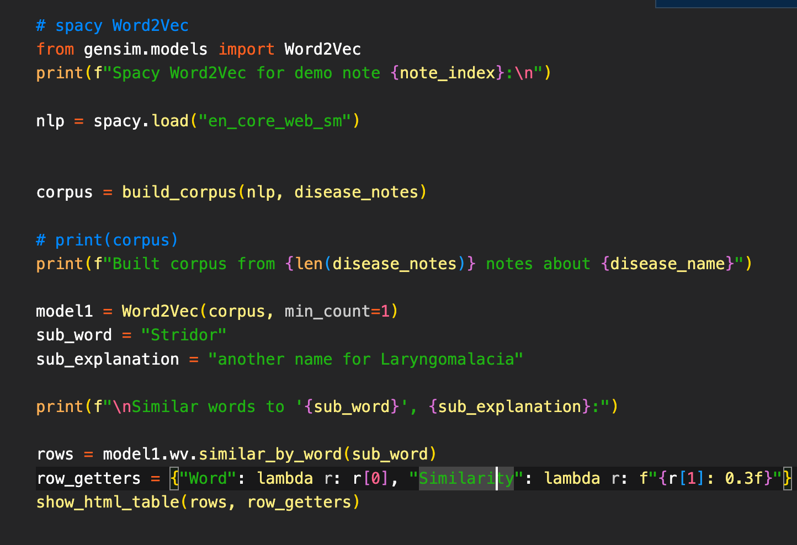

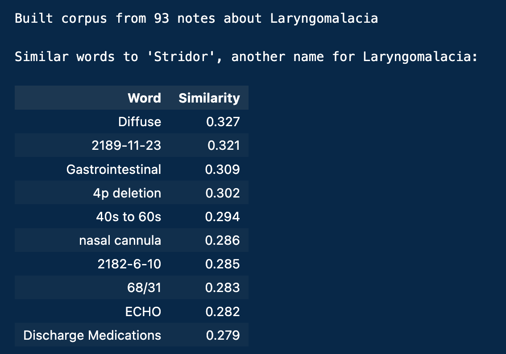


---

## Use Spacy to show tSNE plots of Laryngomalacia notes

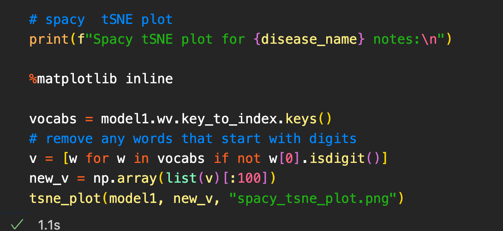

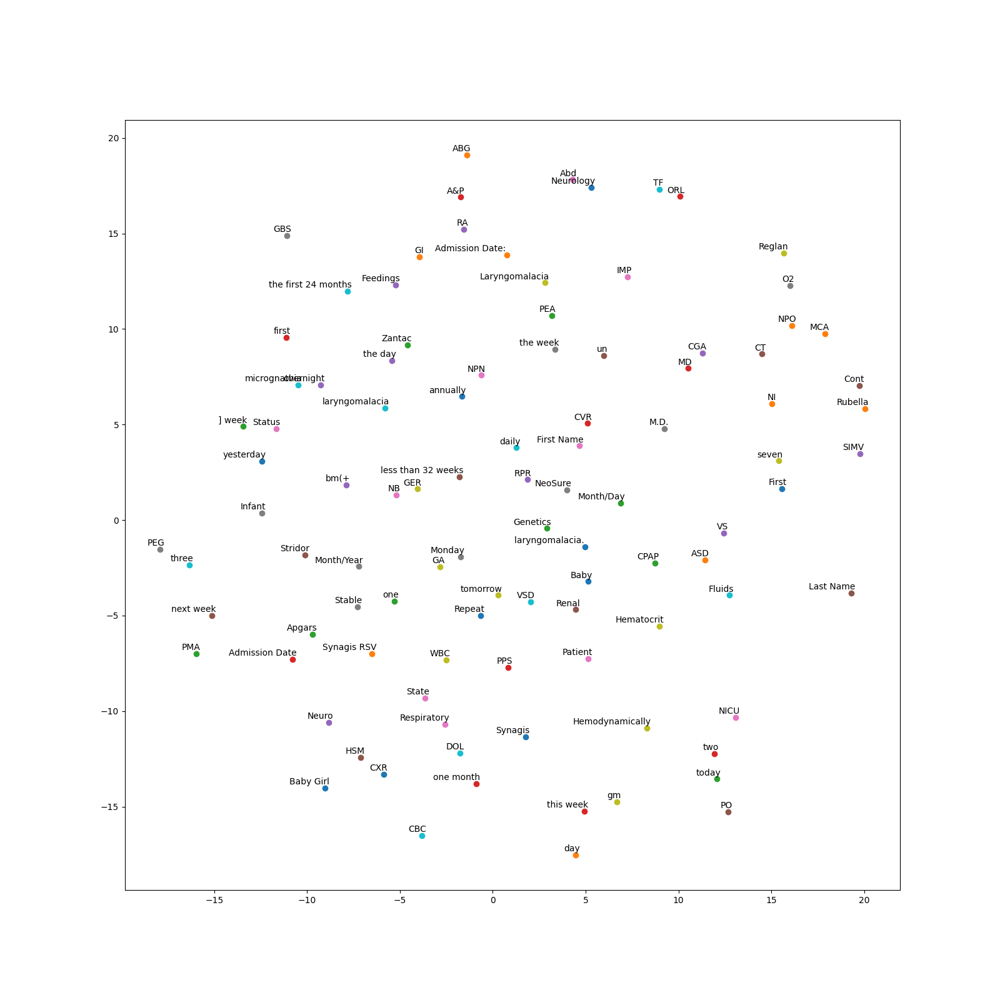

---

## Extract Note Entities with SciSpacy and show results
(Note decreased entity differentiation from default Spacy models)

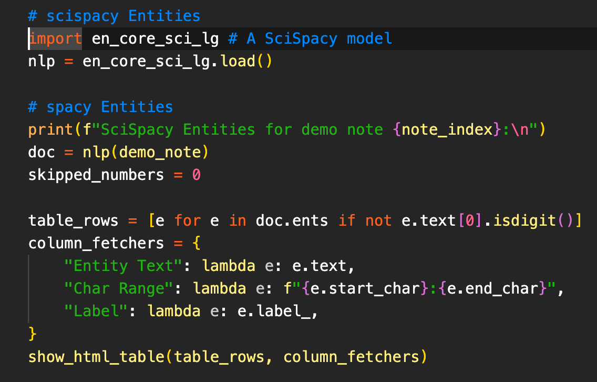

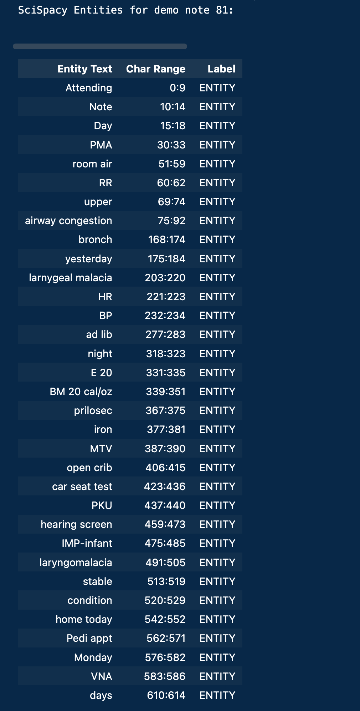

--- 

## Use SciSpacy to run Word2Vec on the Laryngomalacia notes

(Note much more relevant similar words; this medical model knows more!)

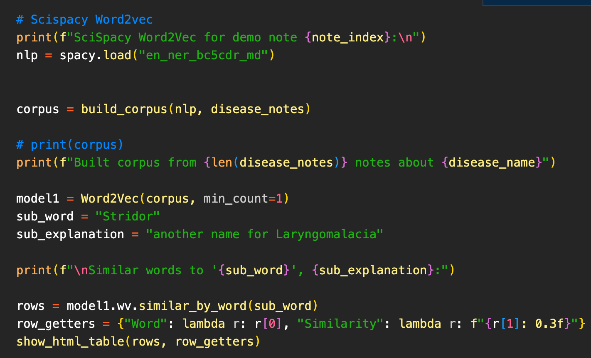

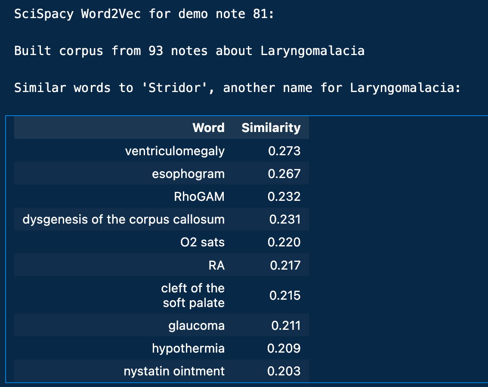

--- 

## Use SciSpacy to show tSNE plots of Laryngomalacia notes

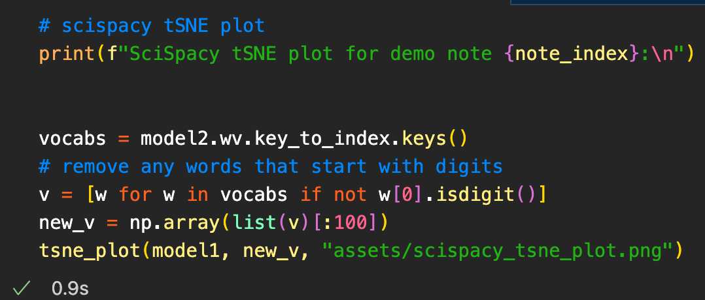

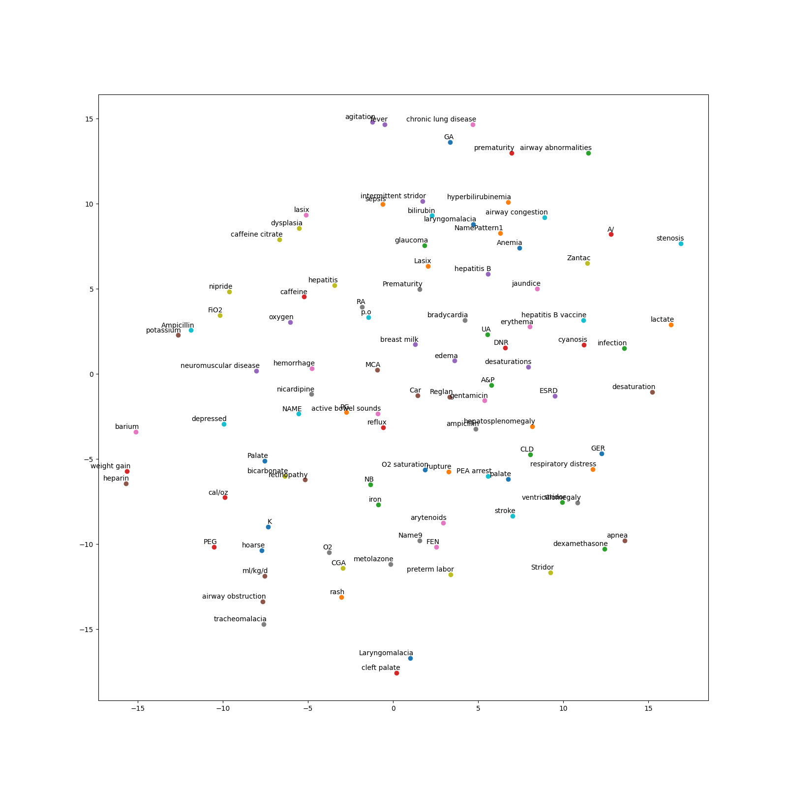
